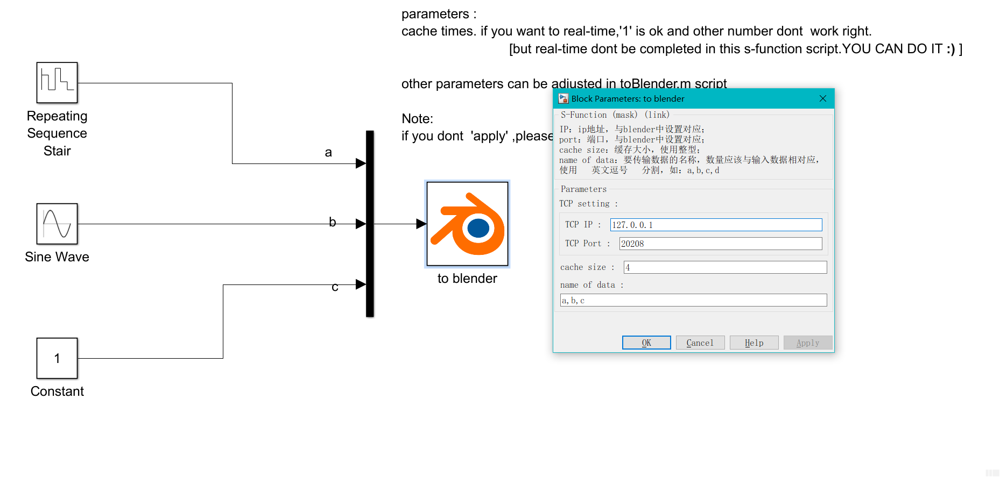
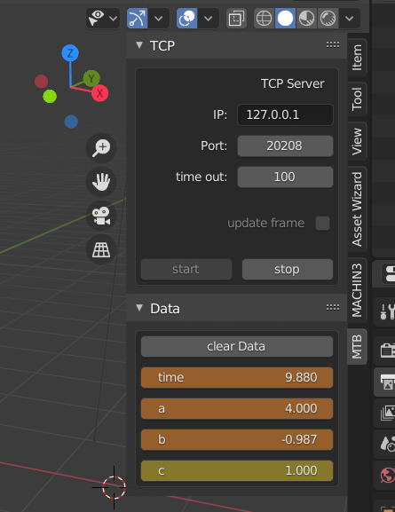

## matlab-to-blender
send data from simulink to blender;
将simulink中的数据传入blender中。
## 软件版本
blender : 2.83
matlab  : 2016b

## 使用方法

simulink:
* 方法一：直接将block.slx中的节点拷贝出来，然后直接使用；
* 方法二：将library文件夹中的内容生成simulink自带的[库模块](https://zhidao.baidu.com/question/1445761744982783980.html)

blender:
安装插件
